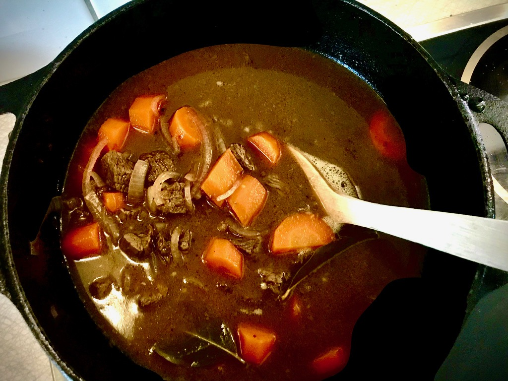

# Kalops

## Description

En klassiker.

## Ingredients

* 800g högrev
* 3msk vetemjöl
* Kalvfond
* 10st hela kryddpepoarkorn, krossade
* 3st lagerblad
* 2st morötter, i grova slantar
* 1st gul lök, skivad
* 1dl rödbetsspad
* matolja
* salt

## Steps

1. Bryn köttet på hög värme i olja.
1. Pudra över mjölet och sänk värmen.
1. Tillsätt vatten och fond så att det täcker.
1. Skiva lök.
1. Skala och dela morötter i stora slantar.
1. Tillsätt kryddor, lök och morötter.
1. Koka i 2-3h med locket på glänt.
1. Smaka av med salt och rödbetsspad 
1. Koka bort vätska efter tycke.
1. Servera med potatis och rödbetor

## Tags

* husman

## Credits

Myllymäki