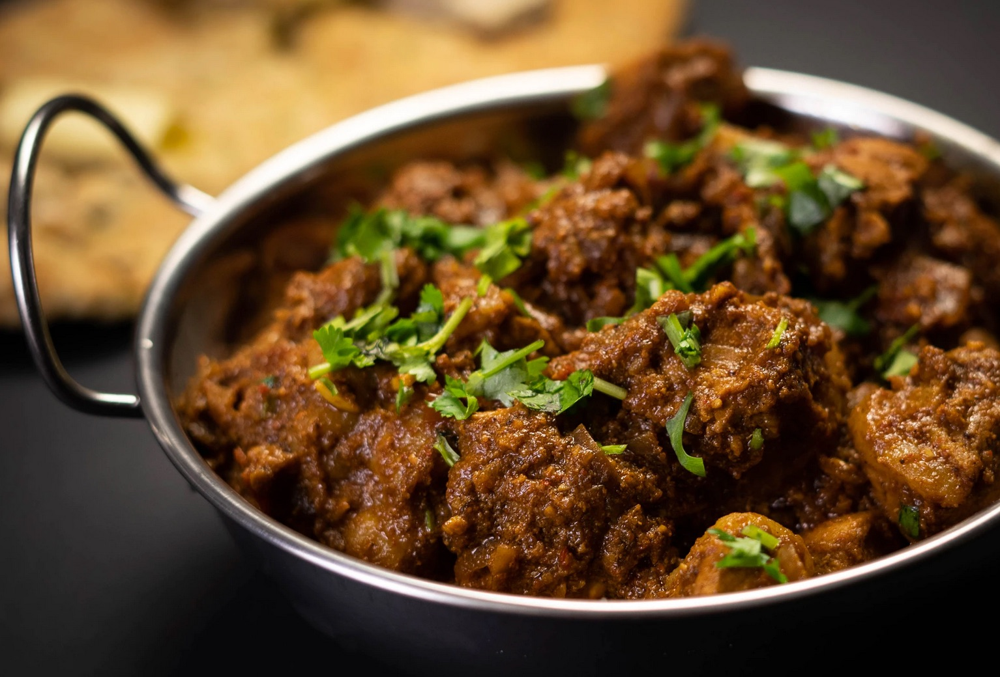

# North Texas Chili

# Description

Chiligryta på högrev.

# Ingredients

* 1kg högrev
* 1st anchochili
* 2st chipotlechili
* 4st valfri chili
* 5st jalapeñochili (inlagd)
* 1pkt bacon
* 15st vitlöksklyftor
* 1dl vetemjöl
* 2,5dl chilipulver (den vanliga snälla sorten)
* 1st tärning mörk oxbuljong
* 1st långburk ljus öl
* 2msk spiskummin
* 2msk oregano
* 2msk malda korianderfrön
* 1msk socker
* salt

# Steps

1. Koka anchon 15 minuter under lock och hacka den övriga chilipepparn.
1. Skär loss det feta på baconet, skiva och fräs det långsamt i stekpannan tills fettet har smält ut. Häll av det mesta och spara till senare.
1. Fräs vitlöken gyllenbrun (men se upp så att den inte blir svart) i stekpannan. Lägg den i grytan.
1. Bryn köttet i omgångar och lägg i grytan.
1. Blanda mjöl och chilipulver och strö över grytan. Blanda om noga.
1. Sila av den kokta anchochilin (från punkt 2) och spara kokvattnet. Kärna ur och hacka den.
1. Tillsätt alla chilisorter, kokvattnet, buljongtärning och öl tills det täcker.
1. Rör ner spiskummin, oregano, koriander, socker och salt. Småkoka tills köttet faller sönder. Det tar cirka 4 timmar. Rör ofta, den bränner lätt fast i botten.
1. Servera med majschips, gräddfil, riven cheddarost, sallad, tortillas, inlagda jalapeños, salsa, guacamole eller vad ni behagar.

# Tags

* chili

# Credits

https://sverigesradio.se/sida/artikel.aspx?artikel=5145918
