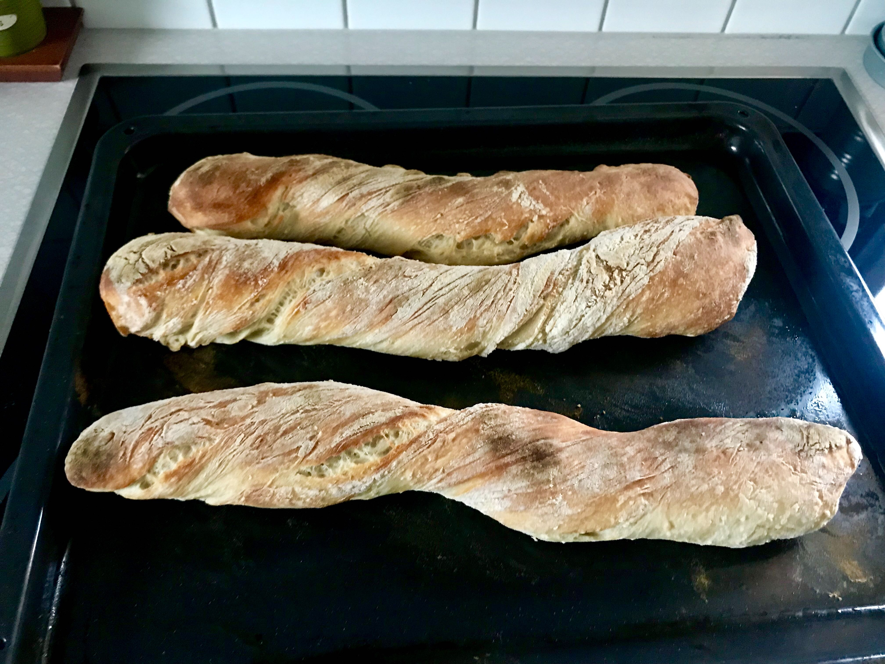

# Description

Genom att använda lite jäst och låta brödet jäsa långsamt över natten krävs lite knådning och brödet blir luftigt och gott.

# Ingredients

* 3 g färsk jäst eller 2,5 krm torrjäst
* 350 g (3 1/2 dl) kallt vatten
* 450 g (7 1/2 dl) vetemjöl special
* 10 g (1 1/2 tsk) salt

# Steps

1. Blanda ingredienser i en bunke. Degen behöver inte knådas utan bara röras till den precis går ihop - för hand eller med maskin.
1. Täck bunken med plastfolie och låt jäsa över natten, ca 8h.
1. Sätt ugnen på 250°C.
1. Skrapa ut degen på ett mjölat bakbord.
1. Dra ut degen till en fyrkant.
1. Vik överkanten mot mitten och sedan underkanten mot mitten.
1. Vik in kanterna.
1. Vänd på degen, strö över lite mjöl och lägg över en bakhanduk.
1. Låt jäsa i 40-60 min.
1. Dela degen i tre delar.
1. Stäck varje del lite, snurra dem ett varv och lägg på en plåt med bakplåtspapper.
1. Grädda i mitten av ugnen tills baguetterna fått ordentligt med färg, ca 15-20min.
1. Låt svalna på galler.

# Tags

* bread

# Credits

https://www.bokus.com/bok/9789174247053/brod-brod-brod-recept-rad-och-genvagar/
http://paindemartin.blogspot.com/2009/06/tredje-forsoket-hej-baguette.html