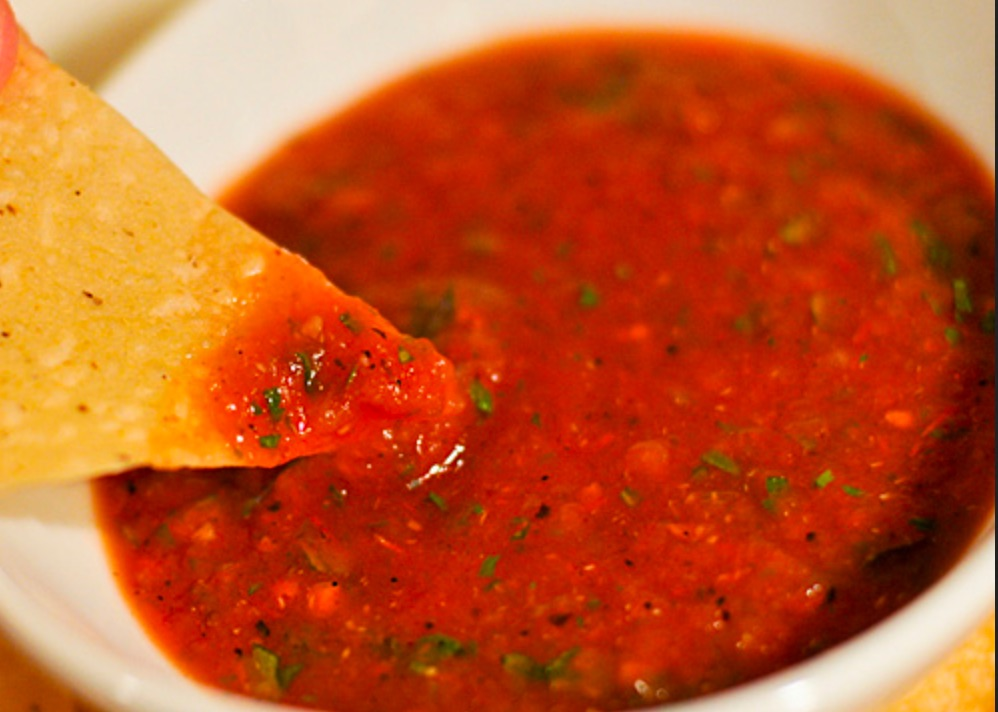

# Description

Genom att rosta ingredienserna först ger en dip som är håller längre och ger en rundare smak med mildare hetta.

# Ingredients

* 6st färska tomater
* Salt
* 1st färsk jalapeño
* 2st vitlöksklyftor
* 1st gul lök
* 1st kruka koriander
* 1st lime
* Socker

# Steps

1. Värm ugnen till 200 grader.
1. Dela tomater och lök i halvor och skala vitlöken.
1. Rosta tomater, lök, vitlök och jalapeno på en plåt i ugnen tills de ha fått färg.
1. Låt svalna.
1. Finhacka eller mixa de rostade grönsakerna.
1. Blanda med koriander och limejuice.
1. Smaka av med socker och salt.
1. Låt stå i kylen i minst 30min.

# Tags

* vegetarisk
* snacks

# Credits

https://www.seriouseats.com/recipes/2012/05/roasted-tomato-salsa.html