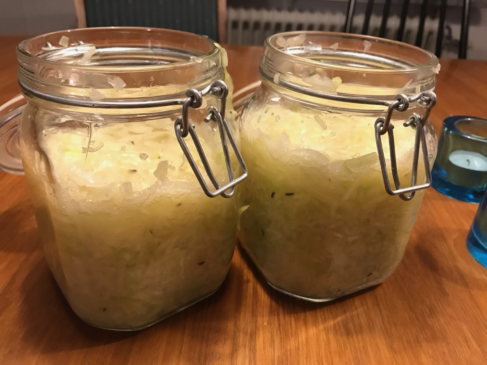

# Surkål

## Description

Går även att ersätta vitkål med morötter eller rödbetor.

## Ingredients

* 2kg vitkål
* 1msk salt (jodfritt)
* 2krm kumminfrön
* 3st lagerblad
* 4st Enbär

# Steps

1. Skölj och strimla vitkålen
1. Blanda med salt och kryddor
1. Stöt kålen i omgångar i en bunke så att den vätskar sig.
1. Rengör konserveringsburkar med kokande vatten.
1. Fyll burkarna med surkål (fyll inte ända upp)
1. Låt stå i två dagar i rumstemperatur (20-22 grader)
1. Låt stå i två veckor i sval (15-18 grader) 
1. Låt stå i 4+ veckor i kylen (0-8 grader)
1. Kålen ska smaka friskt och syrligt. 

# Tags

* vegetarian
* sides

# Credits

Per Moberg